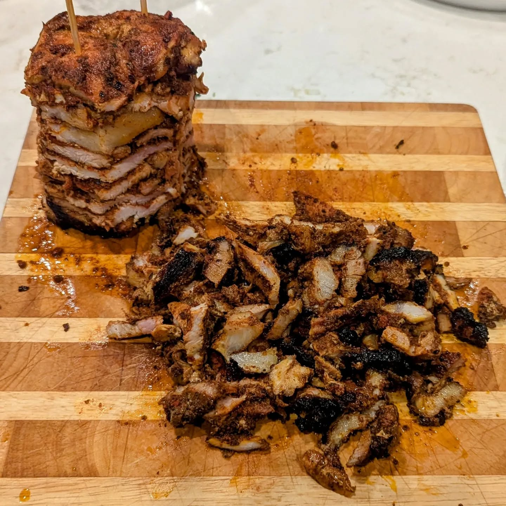

# Convert Instagram Export to Hugo Posts


This script converts an Instagram export file into a set of Hugo posts.

## Pre-requisites

- Instagram export file
- python3

## Set up

1. Create environment

```
pip install -r requirements.txt
```

2. Uncompress the the Instagram export file and copy the `./media/posts/` folder to the root of this project.

```
cp <path>/<to>/media/posts/ .
```

Copy the `posts_1.json` file to the root of this project.

```
cp <path>/<to>/your_insagram_activity/content/posts_1.json .
```

## Converting the export

Run the script

```python
python3 process.py
```

The script creates a `posts` directory. A directory is created for each Instagram post. The directory contains an `index.md` file with Hugo frontmatter and an `images` directory with the pictures associated with the post. The Hugo post title is the day of the post.

This is an example of the post including the frontmatter:

```md
---
title: July 21, 2024
date: 2024-07-21 19:04:40
---


The full Mexican: chile relleno, beef tamales with salsa, Spanish rice, charro beans
```

The script handles multiple images per post and multiple posts per day.

## Copying to Hugo

Depending on the Hugo configuration, copy the `posts` directory to the `./content/posts/` directory in the Hugo install.
